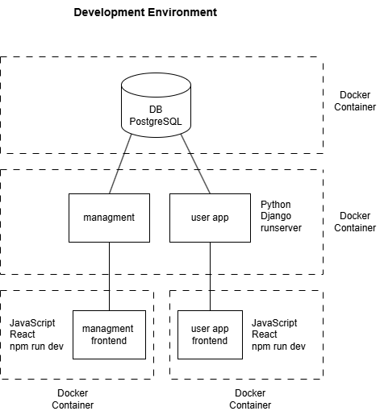

# Agonas - League Management System

Football tournament management platform that replaces every Excel sheet, group chat, and time-consuming manual process.
It brings match scheduling, result reporting, and team management into a single system, making life easier for referees and organizers.

**Stack**: Django + Django Ninja, React + Vite, PostgreSQL, Docker Compose.


## Architecture
The backend is a single Django server containing two apps: `api` (for league admins, served at `/api/`) and `userapp` (for players, referees, and guests, served at `/app/api/`). Each app backs its own React frontend. All services orchestrated with Docker Compose.




| Component  | Purpose | Port |
|---|---|---|
| Management Frontend | Dashboard for organizers (managing teams, matches, scores, ..) | 5173 |
| User App Frontend | App for users (browsing, referee forms, ..) | 5174 |
| Django backend | REST API, auth, business logic, media uploads | 8000 |
| PostgreSQL | Persists all match/team/referee data | 5432 |


**Auth**: Session-based, admin sign-in via `/api/auth/`, app users via `/app/api/auth/`.

**Core entities**:<br>
&nbsp;&nbsp;&nbsp;&nbsp;For the admin panel: Team, Player, Referee, Stadium, Match, Tournament/Phase.<br>
&nbsp;&nbsp;&nbsp;&nbsp;For the user app: App User

**Docker**: Each service has its own Dockerfile (`backend/`, `frontend/`, `userapp/`), `docker-compose.yml` combines them.


## Setup

Must be installed: Docker + Docker Compose, Git.

1. Clone the project:
   ```bash
   git clone https://github.com/odimos/agonas.git
   cd agonas
   ```

2. Create the two `.env` files and fill them in.

   `./.env` (project root, for Postgres + backend):
   ```env
   POSTGRES_DB=<your_db_name>
   POSTGRES_USER=<your_db_user>
   POSTGRES_PASSWORD=<your_db_password>
   POSTGRES_HOST=db
   POSTGRES_PORT=5432
   ```

   `./frontend/.env` (for the management frontend):
   ```env
   VITE_API_URL=http://localhost:8000/api
   ```

3. Build images:
   ```bash
   docker compose build
   ```

4. Initialize the database (or use the demo data, listed at the end) :
   ```bash
   docker compose up db
   docker compose run --rm backend python manage.py migrate
   ```

5. Start the stack (in separate terminals, for dev work):
   ```bash
   docker compose up db
   docker compose up frontend
   docker compose up backend --no-deps
   ```

Services:
- backend (Django) → http://localhost:8000
- frontend (admin/dashboard) → http://localhost:5173
- userapp → http://localhost:5174
- db (Postgres 15) → localhost:5432

### Load demo data (optional)

Instead of step 4 above, you can use my database snapshot. The snapshot already contains the schema and demo records, so **skip `makemigrations` / `migrate`**. Your `.env` credentials from step 2 will work fine.

1. Download `agonas_snapshot.sql` from https://github.com/odimos/agonas/releases/tag/database and place it in the project root (next to `docker-compose.yml`).

2. Start the DB and load the snapshot (use your own values from `.env`):

   ```bash
   docker compose up db
   docker compose exec -T db psql -U <your_db_user> -d <your_db_name> < agonas_snapshot.sql
   ```

   On Windows PowerShell:

   ```powershell
   docker compose up db
   Get-Content agonas_snapshot.sql | docker compose exec -T db psql -U <your_db_user> -d <your_db_name>
   ```

Then continue with step 5.
